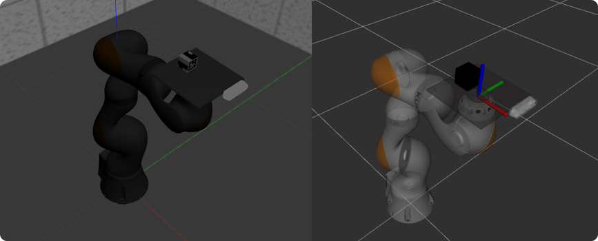
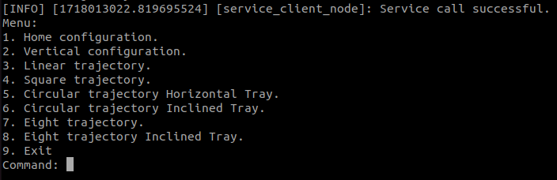
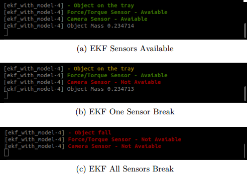

# Sensor Fusion For Object Pose Estimation in Non-Prehensile Tray-Based Transportation
This repository provides the entire development environment for a non-prehensile manipulation application consisting of a manipulator with a tray carrying an object. The Extended Kalman Filter performs the sensor fusion of sensory data to estimated object pose (x,y,yaw) on the tray.


## :package: Package Overview
- [`apriltag`](./apriltag): is a ROS2 wrapper of the AprilTag visual fiducial detector. 
- [`apriltag_ros`](./apriltag_ros): depends on the latest release of the AprilTag library. Clone it into your catkin workspace before building.
- [`data`](./data): it isn't a ROS2 package but a simple folder where any CSV files containing the numerical data acquired in the simulations have been inserted.
- [`ekf_pkg`](./ekf_pkg): contain two version of EKF.
- [`iiwa_description`](./iiwa_description): URDF description of Kuka Iiwa manipulator including its sensors, planner and inverse dynamics control.
- [`iiwa_msgs`](./iiwa_msgs): contains a customised composed message used for Client-Server interaction between planner and user menu.
- [`real_experiments_pkg`](./real_experiments_pkg): for any user is useless because it contains all the scripts related to the experimentation phase on real hardware used for the master's thesis.
  
## :hammer: How to Build
To build the packages in this repository follow these steps:
1. `cd` into an existing [ROS2  workspace]([http://wiki.ros.org/catkin/Tutorials/create_a_workspace](https://docs.ros.org/en/humble/Tutorials/Beginner-Client-Libraries/Creating-A-Workspace/Creating-A-Workspace.html)) or create a new one:
   ```console
   mkdir -p noprehensileman_ws/src
   ```

2. Clone this repository in the `src` folder of your ROS2 workspace:

   ```console
   cd noprehensileman_ws/src
   ```

   ```console
   git clone https://github.com/AndreaMazzera/SensFusNonPrehensileManipulation.git
   ```
      
3. Install the requried binary dependencies of all packages in the catkin workspace using the following [`rosdep` command](http://wiki.ros.org/rosdep#Install_dependency_of_all_packages_in_the_workspace) (I added this command because I've read that it often helps with the dependency issue):

   ```console
    rosdep install -i --from-path src --rosdistro humble -y
   ```

4. After installing the required dependencies build the ROS2 workspace. Hint: colcon build with its parallel compilation of packages could saturate the CPU by blocking the PC. To avoid this it is best to add the --executor sequential parameter to force it to a sequential build.

   ```console
   colcon build --executor sequential
   ```
   
5. Finally:

   ```console
   source install/setup.bash
   ```

## :white_check_mark: Usage
To test the project open four terminal and launch respectively:
1. Launcher for Gazebo, Rviz, manipulator with relative controller (inverse dynamics in operational space) and planner: 

  ```console
  ros2 launch iiwa_description bringup.launch
  ```

2. Laucher for user menu where you can select desired trajectory:

  ```console
  ros2 launch iiwa_description service_client_node
  ```
<div align="center">  </div> 

3. Launcher for EKF. The package present two EKF: model-based (option A) and sensor-based (option B). After it ask if you want change gains of EKF (attention: these are taken from the ekg_pkg folder in ‘install’).

  ```console
  ros2 launch ekf_pkg ekg.launch
  ```
  This console displays some useful information (updated every 3 seconds) such as whether the object has fallen or not and what sensors data are available.
  
<div align="center">  </div> 


4. Launcher for plotjungler to visualize all important data:
   
  ```console
  ros2 run plotjungler plotjungler
  ```
